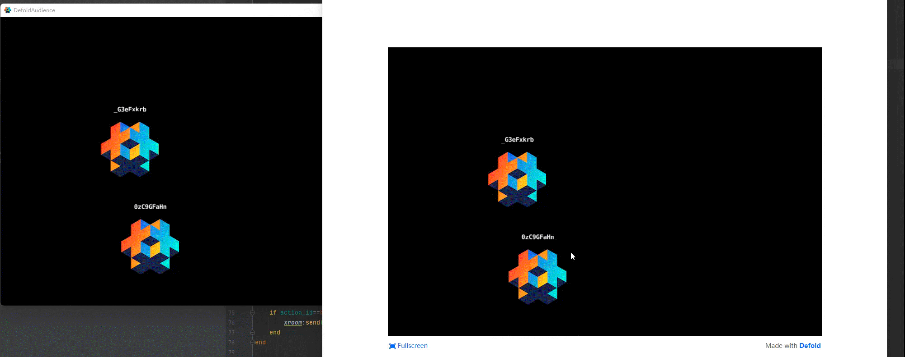

使用 Colyseus 实现 游戏与观众 功能的简单示例

客户端: Defold
服务端: Colyseus

客户端角色分为两种, 玩家与观众
玩家: 进入游戏房间, 可以被所有人看到, 可以控制自己的角色
观众: 进入观众房间, 不能被看到, 不可以控制任何角色, 但是可以观看游戏房间的游戏内容



# Welcome to Colyseus!

This project has been created using [⚔️ `create-colyseus-app`](https://github.com/colyseus/create-colyseus-app/) - an npm init template for kick starting a Colyseus project in TypeScript.

[Documentation](http://docs.colyseus.io/)

## :crossed_swords: Usage

```
npm start
```

## Structure

- `index.ts`: main entry point, register an empty room handler and attach [`@colyseus/monitor`](https://github.com/colyseus/colyseus-monitor)
- `src/rooms/PlayerRoom.ts`: an empty room handler for you to implement your logic
- `src/rooms/schema/MyRoomState.ts`: an empty schema used on your room's state.
- `loadtest/example.ts`: scriptable client for the loadtest tool (see `npm run loadtest`)
- `package.json`:
    - `scripts`:
        - `npm start`: runs `ts-node-dev index.ts`
        - `npm test`: runs mocha test suite
        - `npm run loadtest`: runs the [`@colyseus/loadtest`](https://github.com/colyseus/colyseus-loadtest/) tool for testing the connection, using the `loadtest/example.ts` script.
- `tsconfig.json`: TypeScript configuration file


## License

MIT
